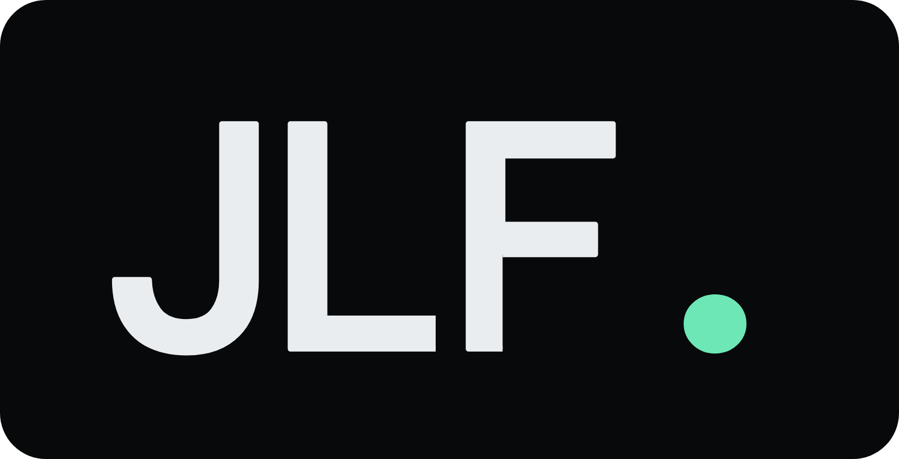

<div align="center">



# João Lucas Freitas — Portfólio

**Desenvolvedor Backend .NET**

[](https://react.dev/)
[](https://www.typescriptlang.org/)
[](https://vite.dev/)
[](https://vercel.com/)

**[Acessar o portfólio publicado](https://my-portflolio.vercel.app/)**

</div>

## Sobre

Portfólio profissional de João Lucas Freitas, desenvolvido para apresentar sua trajetória, especialização em Backend .NET e projetos recentes de forma clara e objetiva.

A interface combina uma estética técnica com uma apresentação moderna, responsiva e acessível. A identidade visual é construída ao redor da assinatura **JLF.**, preservando referências sutis a código sem comprometer a leitura.

## Projetos em destaque

- **[EasyMDO](https://github.com/LukeUp2/EasyMDO-api)** — produto full-stack para gestão de membros, grupos e acompanhamento semanal, com API .NET, autenticação JWT, PostgreSQL e interface React.
- **[RpgSheet.Api](https://github.com/LukeUp2/RpgSheet.Api)** — API para fichas de RPG, atributos, perícias e retratos, com Entity Framework, Supabase e Docker.
- **[d20-tools](https://github.com/LukeUp2/d20-tools)** — aplicação full-stack de ferramentas para RPG, construída com ASP.NET Core e frontend .NET.
- **[CashFlow](https://github.com/LukeUp2/CashFlow)** — API de fluxo de caixa organizada em camadas, com validação e tratamento global de erros.
- **[TaskManager](https://github.com/LukeUp2/TaskManager)** — API de gerenciamento de tarefas em .NET 8 com Clean Architecture e documentação Swagger.

## Tecnologias do portfólio

- React 19
- TypeScript 5
- Vite 8
- CSS responsivo sem framework visual
- Lucide React para ícones
- ESLint para análise estática
- Vercel para hospedagem e deploy contínuo

## Recursos da interface

- Layout responsivo para desktop, tablet e celular.
- Navegação semântica por seções.
- Componentes reutilizáveis para projetos e player de música.
- Música ambiente opcional e desativada por padrão.
- Foco visível, link de salto e suporte a movimento reduzido.
- Metadados de idioma, descrição, tema e compartilhamento social.
- Conteúdo profissional direcionado a oportunidades em Backend .NET.

## Kit de marca JLF.

O repositório inclui um [kit de marca completo](./brand/README.md) com:

- Logotipos vetoriais em SVG.
- PNGs transparentes em alta resolução.
- Versões para fundos claros, escuros e monocromática.
- Ícone quadrado para avatares e redes sociais.
- Paleta de cores, tipografia e regras de aplicação.

O pacote também pode ser baixado diretamente em [`JLF-brand-kit.zip`](./JLF-brand-kit.zip).

## Executando localmente

### Requisitos

- Node.js 20.19 ou superior — ou Node.js 22.12 ou superior.
- npm.

```bash
git clone https://github.com/LukeUp2/my-portflolio.git
cd my-portflolio
npm ci
npm run dev
```

O servidor de desenvolvimento exibirá no terminal o endereço local da aplicação.

## Validação e build

```bash
npm run lint
npm run build
npm run preview
```

O build de produção é gerado na pasta `dist`.

## Estrutura principal

```text
brand/                         # Kit de identidade visual JLF.
public/                        # Áudio, favicon e recursos públicos
src/
├── components/
│   ├── MusicPlayer/           # Player de música ambiente
│   └── ProjectItem/           # Cartão reutilizável de projeto
├── App.tsx                    # Conteúdo e estrutura da página
├── App.css                    # Layout e componentes visuais
├── index.css                  # Estilos globais e tokens de design
└── main.tsx                   # Inicialização da aplicação
```

## Deploy

O projeto está conectado à Vercel. Alterações enviadas para a branch `main` passam pelo build e são publicadas automaticamente em produção.

---

Desenvolvido por **[João Lucas Freitas](https://github.com/LukeUp2)**.
